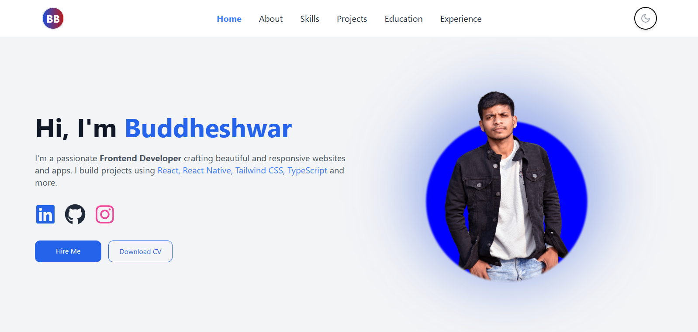

# 🌐 My Developer Portfolio

Welcome to my personal developer portfolio! This project showcases my skills, projects, and passion for web development. Built with modern technologies and a focus on responsive, user-friendly design.

## 🧑‍💻 About Me

I'm a passionate developer focused on building clean, efficient, and interactive web experiences. This portfolio is a reflection of my journey, learning, and achievements in the tech world.

## 🚀 Features

- ⚡ Fully responsive design
- 🌗 Light/Dark mode toggle
- 💼 Project showcase with GitHub and Live Demo links
- 📞 Contact form with validation
- 🧩 Tech stack icons and resume download option

## 🛠️ Built With

- **React.js**
- **TypeScript** _(optional if you're using it)_
- **Tailwind CSS** or **CSS Modules**
- **React Icons**

📦 Installation

Follow these steps to run the project locally:

1. **Clone the repository**

````bash
git clone https://github.com/yourusername/your-portfolio.git
Navigate to the project directory

cd your-portfolio

npm install

npm run dev
# or
npm start

```
Your app will be running at http://localhost:5173//

Make sure you have Node.js and npm installed on your system.

## 📸 Preview



> *(Include a screenshot image of your portfolio or a demo gif here)*

## 🔗 Live Demo

👉 [View Live Site](https://my-portfolio-buddheshwar2003.vercel.app/)

## 📁 Project Structure

```bash
├── public/
├── src/
│   ├── components/
│   ├── pages/
│   ├── assets/
│   ├── App.tsx
│   └── index.tsx
├── .gitignore
├── package.json
├── README.md
└── tsconfig.json (if using TypeScript)
````
